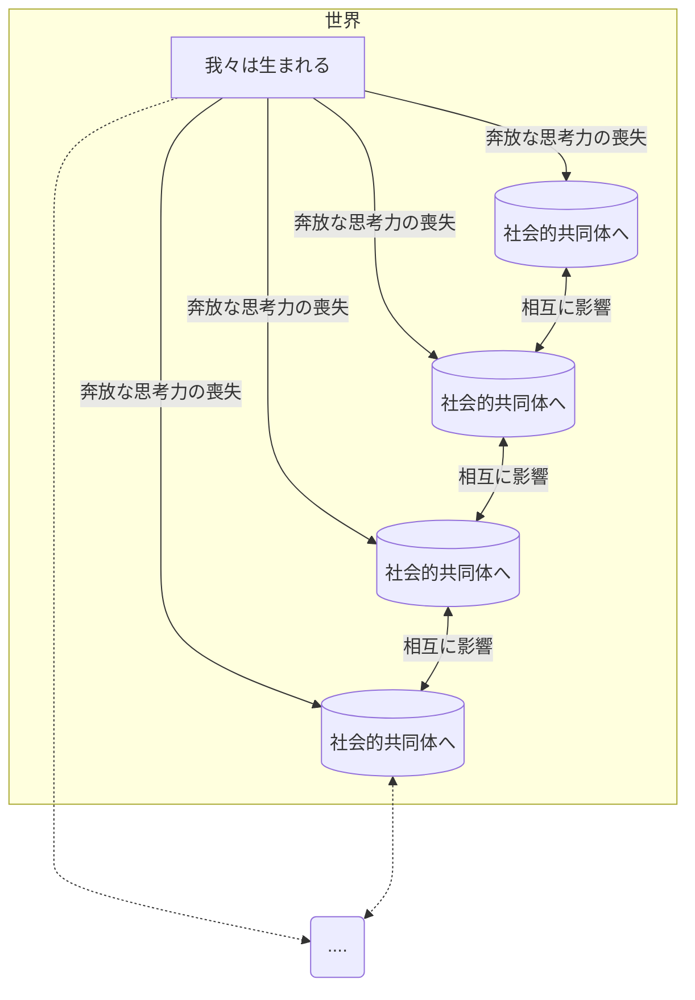
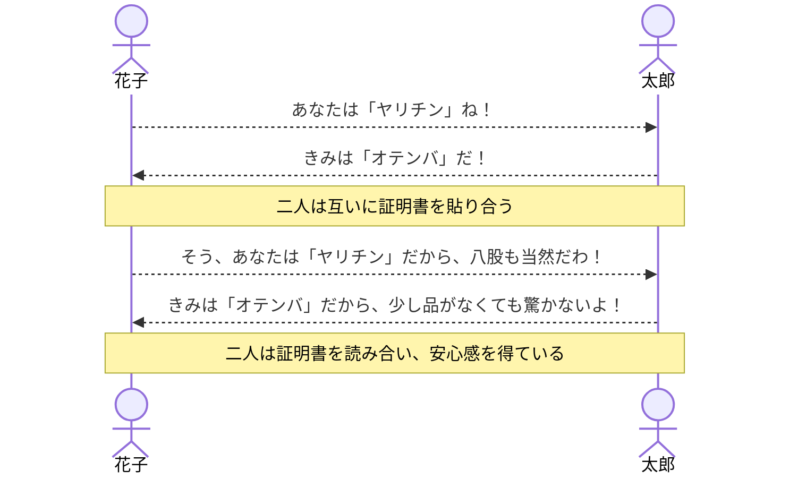
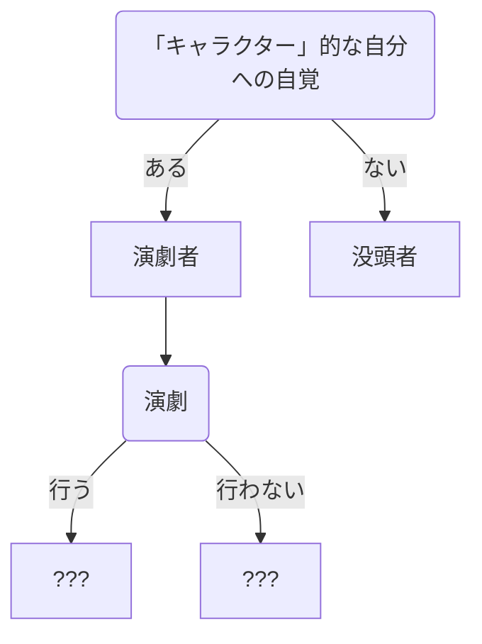
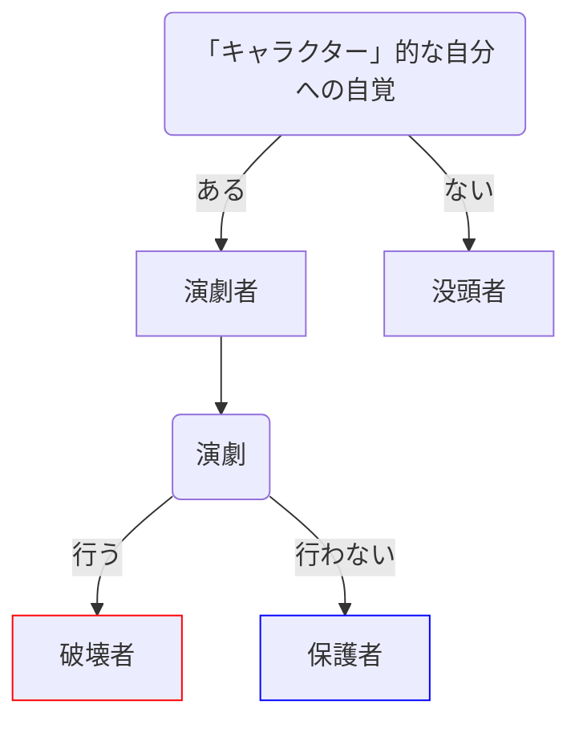

# 「キャラクター」に一貫性を持たせることの〈演劇性／共通に自覚された共犯性に依る有意義性〉について。あるいはカオス的降神論。


### 一般に社会的共同体の中では、人々はその人に固有な「キャラクター」を着せられ、その「キャラクター」の規範に縛られて行動をしなくてはならない。これは、外的、内的な心理的圧力に拠る。そして誰かの「キャラクター」は、常に「一貫性／統一性」を持たなくてはならない。その「一貫性／統一性」には社会的にどういった意味があるのか。ここではその「一貫性」の持つ、円滑な社会生活を送る上での、合理的な意義について論考する。

`この論考での私の目論見: 一貫性のあるキャラクターを志向することが、有意義であるか否かについて、「有意義ではない」と結論を下し、新時代のカオス的な非一貫性のキャラクターを構想／提案、実践する。そしてそのカオス的な非一貫性のキャラクターは、すべてのキャラクターにそのキャラクター性を自覚させるように働きかけるため、そのカオス的な非一貫性のキャラクターのみによって構成された社会共同体は、その無限性によって、神格化される、と説くこと。`

## 第一章 「キャラクター／ペルソナ」とは何か

`こんにちは。もともとパンダだった人です。今回は、「キャラクター」化される現代人の運命について考えます。どうぞ、頑張ってついてきてください。私も尽力します。この文章が、なんらかのとっかかりになれば幸いです。`

我々[^1]は誕生する。そして、生を授かった生き物の宿命として、その種の〈社会的共同体〉に否応なく所属させられる。
しかし〈共同体〉とは恐ろしいもので、我々の自由な考えに「枷」を与え、有限化し(束縛し)、我々が生得的に保持していた奔放な思考力[^2]を奪ってしまう。その代わり、我々は〈共同体〉の滑らかで穏やかなシステムに参画することができる。



その「共同体」において、我々は多種多様な「キャラクター／ペルソナ」を獲得し、場面ごとに使い分けることになる。その人の「キャラクター／ペルソナ」とは、その人が〈社会的共同体〉に参加するための、いわば*パスポートである*。「こういう人間です」という証明書がおでこに貼られ、その証明書無しでは「共同体」内で受容されにくい。これがキャラクターである。



1. **「キャラクター」を持つことは、その人物の予測可能性の証(あかし)である。**

類型化されたキャラクター。法則化されたキャラクター。これらは、その人物の行動に一定の規則を与え、その人物を予測可能な「キャラクター」にする。たとえば「ある人物がいきなり壁を殴った」とする。もしその人物が「やんちゃ」であるなら、その「いきなり壁を殴った」という行為は、*異常ではなく平常として*認識される。「キャラクター」を人物に付与することによって、人物の「行動」と「その人物」の間には合理的な因果関係が捻出される。そのため、ある人物によってどれだけ常識外れな行動が突如として行われたとしても、単に「その人物は〈やんちゃ〉だからだ」という理由によって、その奇怪な行動を、「理解可能／意味自明なもの」にできる。

2. **「キャラクター」とは、「その人物」と「その人物のする行動」との間に、他人やその人物自身が因果関係を見出すことによって自然に発生する、「その人物とその人物がその社会的コンテクスト内で取る行動全般との間に見られる相関の法則のこと」である。**

その人物の持つ、「独自なリズムの法則」を「キャラクター」と人々は呼ぶ。そして、その人物がその「リズムの型」から逸脱すれば、軽度な場合、その人物は「キャラ崩壊」したと喜ばれ[^3]、これが過剰になると「別人」のよう、「気が狂った」「意味不明」だと呼ばれるようになる。人々はその人物についての蓋然性を突如として失ってしまうのだ。

3. **「キャラクター」は、その社会的コンテクスト内でその人物が取る行動の、許容範囲を規定する。**

「突飛な」キャラクターは、「突飛な」行動を取ることを潜在的に勧められ、許される[^4]。そしてその人物が、少し「常識的な」行動をとれば、まず「キャラ崩壊」だと喜ばれる。しかし、その人物がいつまでもその「常識的」なリズムをやめない場合、社会が要求する「彼に独自なリズム(彼に付与された予測可能性の法則)」から大きく逸脱することになり、社会の予想を裏切ることになる。その人物の許容範囲外の行動をその人物が行ってしまったため、やがてその人物には、「気が狂った」「意味不明」などという称号[^5]が与えられる。このように「キャラクター」は、その人物の取る行動の許容範囲を規定する。


まとめると、「キャラクター」には３つの要素がある。

1. 予測可能性の証明(蓋然性の担保)
2. 行動と人物の相関の法則
3. 行動の許容範囲の規定

***つまり、「キャラクター」は、その社会的コンテクストにおいて、「その人物」と「その人物によって起こされる出来事」を予測可能なものにするため存在し、「キャラクター」が「その人物と行動の相関の法則」として、その人物の取れる行動の許容範囲を規定することによって、実際に「その人物」ないし「その人物によって起こされる出来事」が予測可能なものになる、ということである。***

もっと言えば、
***「キャラクター」はその人物を「予測可能なものにするため」に存在する***、のである。あなたの社会的な「**蓋然性*＊」が、キャラクターなのである。

```
付記: 具象物が本来的に持つ「奇怪」をラッピングする「名前(言葉)」が、擬人的なものに応用された場合、それは「キャラクター」と呼ばれる。
本来的な世界の意味不明性を、覆い隠す　「言葉」の役割が、キャラクターである。
```

[^1]: 一人称複数形であるため、この語を目撃するただそれだけのことによって、あなたはなんらかのグループに強制的に参加させられることになる。ここでは、おおよそ共通なコンテクストを持つ人々くらいを指す。
[^2]: 奔放な思考力とは、奔放であるために、実用的では無いものである。こういった思考しか行えない場合、危機から逃れるために論理的な道筋を思いつかない。
[^3]: 軽度なリズムのズレは、退屈を紛らわすので、喜ばれる。
[^4]: ある人物の「キャラクター」を強固にすることは、ある人物の「予測可能性」を上げることを意味し、ある人物の行動が予測しやすいほど、生み出されるランダムな刺激が減り、「安心できる」ため、社会(自身も含め)は人物の「キャラクター」化を勧める。
[^5]: この称号によって、「キャラクター」では無くなったその人物は、「意味不明」なものとして、新たな理解(安心)の内に加えられる。

### 潜在的に自覚される〈演劇性〉

「キャラクター」は、その人物によって「自覚されている場合（演劇される）」と「自覚されていない場合（自然体で振る舞う）」の2パターンがある。前者の場合、まず「演劇」を「行うか／行わないか」の選択が生じる。この状態に陥った「キャラクター」者[^6]を「演劇者」と呼び、またこういった葛藤（演劇を行う／行わない）に駆られることのない、「キャラクター」への自覚が少ない後者の状態を、「没頭者」と呼ぶことにする。そして、それらの演劇や没頭が行われる社会の場を、「舞台」と呼ぶこととする。前者も後者も、舞台において社会的な交流を行っているという点において、役割を与えられた「役者」ではある。その上で、自覚的になった場合を、今回は場(舞台)における「演劇者」と呼ぶことにここではする。



問題は、前者についての方が複雑である。そもそも「***キャラクター***」***的な自分を自覚する***とはどういうことなのか。
前項で触れたように、「キャラクター」は、環境依存的(社会依存的)に与えられる、あなたの蓋然性のことである。その理解を持った上で、その蓋然性を認識する、とはどういうことなのか。つまり…

***「蓋然性」(キャラクター)への自覚は、「舞台」を破壊する、破壊者たりうる自己への自覚である。***

自己が舞台において、蓋然性として働いているという認識が得られるとすればそれは、「どういう行動を取れば、他の役者や舞台にとってふさわしいのか、理解すること」を意味する。つまり、舞台を破壊しないために、自身が取るべき行動を理解してしまっているわけである。そのすべきに反する行動を取れば、つまり***演劇をしなければ***舞台は破壊される。その破壊の選択を与えられているのが、「演劇者」なのである。また、破壊しない場合にも、自身のキャラクターにふさわしい行動がなんたるかを理解しているわけであるから、蓋然性を律儀に守る優等生としての行動もできる。

***「蓋然性」(キャラクター)への自覚は、「舞台」の温室性を守る、保護者たりうる自己への自覚である。***



言い忘れていた。「舞台」は、安全安心の温室である。自分たちの、ルール・道徳・あたりまえがすべてであって、それらの非合理性を指摘するものは何もない状態。「舞台」は、いつでも外敵によって破壊されうる。「外敵」については、のちにまた解説することにする。

[^6]: 「キャラクター」を与えられた人物。

### 「キャラクター」は心理的に〈演劇者〉を抑圧する／「キャラクター」化のネガティヴな側面／「没頭者」の無自覚な暴力性
## 第二章 「非一貫性」は「キャラクター」を脱構築化させる
### 非一貫性＝拘束する社会への反抗
### 〈演者〉である状態を、内部に属しながら放棄する
### 〈一貫的なキャラクターの死〉が〈無限的なキャラクターの生成〉を誘発する
## 第三章 〈甘きカオス〉よ、来たれ！


### 「カオス的社会」の訪れ
### 「カオス的社会」は全てを無限化させる
### 無限化する解釈
### 実質的な神の降霊

# エピローグ 社会的共同体の〈神格化〉
たとえば、「陽キャ」的キャラクターは、「陽キャ」的な行動規範に基づき行動をしなくてはならないという、潜在的な社会的圧力に晒されている。

### [付録]  仲良くなる　=「キャラクター」の固定化
